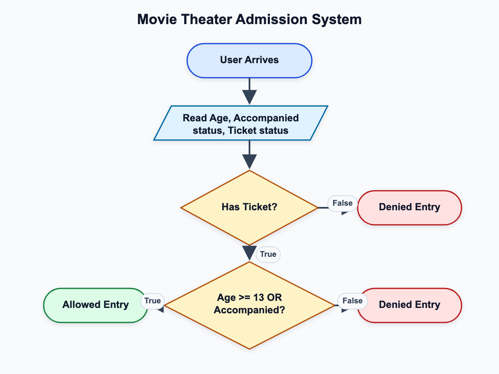

# Project Name: CodeHub (Programmers Group Platform)

## 1. Overview
A comprehensive interactive academic system designed to facilitate programming collaboration and technical project management among IT students. The system provides a centralized environment for sharing resources, forming teams, and developing software with the assistance of AI technologies.

## 2. Problem Statement
Computer science and programming students face challenges in finding a unified environment that allows them to coordinate teamwork efficiently, share source code securely, and receive immediate technical assistance for solving complex problems or reviewing project engineering standards outside of academic lecture hours.

## 3. Proposed Solution
Developing a comprehensive web platform that provides dedicated team workspaces, a task management system, and an integrated coding engine powered by the Gemini API to analyze code, debug errors, and provide technical explanations based on computer science fundamentals.

## 4. Goals & Objectives
* Provide a digital workspace that enhances collaboration among Programmers Group members.
* Reduce the time spent on setting up and coordinating university projects and hackathons.
* Improve the quality of students' code through automated code review tools.

## 5. Target Audience
* IT students at various academic levels.
* Developers and programmers interested in forming teams to build real-world applications.
* Academic staff looking to monitor and evaluate student project performance.

## 6. System Architecture
The system relies on a Client-Server Architecture using a RESTful API model. The frontend connects to data processing servers that manage relational databases and integrate with cloud storage and external AI services via secure protocols.

## 7. Tech Stack & Tools
* **Frontend:** React.js and Next.js to ensure fast response times and optimized rendering.
* **Backend:** Node.js with Express.
* **AI Integration:** Google Gemini API for natural language processing and code analysis.
* **Database:** PostgreSQL.
* **Version Control:** Git & GitHub.
* **UI/UX Design:** Canva & Figma.

## 8. Business Plan
The sustainability model relies on academic partnerships. The system will be provided as a free tool for students, with the potential to generate revenue or achieve sustainability through:
* Financial support and grants from the faculty to develop the infrastructure.
* Offering premium subscription plans for teams requiring massive cloud storage.
* Local tech company sponsorships for hackathons and events hosted on the platform.

## 9. Scalability & Future Roadmap
* **Q1:** Launch the Beta version for IT students and gather empirical data.
* **Q2:** Integrate software testing tools directly into the platform.
* **Q3:** Launch a mobile application compatible with iOS and Android to ensure faster access.
* **Q4:** Expand the platform's scope to include other faculties and provide support for additional programming languages.

---

# Activity: Movie Theater Admission System

## 1. Identify the Components

### 1.1. What are the inputs?
The system requires three primary inputs to evaluate the condition:
* **Age** (Integer): The numerical age of the user.
* **Accompanied** (Boolean): Indicates whether the user is accompanied by an adult (True / False).
* **Ticket** (Boolean): Indicates whether the user possesses a valid ticket (True / False).

### 1.2. What is the process?
The process involves evaluating the inputs against a predefined Boolean logic expression. The ticket is a mandatory condition (AND), while the age or accompaniment are secondary alternative conditions (OR).
Let $A$ = Age >= 13, $B$ = Accompanied, and $C$ = Has Ticket.
The processing logic is defined by the expression: $Z = (A \lor B) \land C$

### 1.3. What is the output?
The output is a single Boolean decision:
* **Admission Decision:** Returns True (Admission Allowed) or False (Admission Denied).

---

## 2. Design the Algorithm


### 2.1. Create the diagram using draw.io / canva / etc.

```mermaid
flowchart TD◊
    Start([Start]) --> Input[/Input: Age, Accompanied, Ticket/]
    Input --> Dec1{Has Ticket == True?}
    Dec1 -- No --> Denied([Admission Denied])
    Dec1 -- Yes --> Dec2{Age >= 13 OR Accompanied == True?}
    Dec2 -- Yes --> Allowed([Admission Allowed])
    Dec2 -- No --> Denied
```

### 2.2. Complete the Truth table

The logical expression for the admission policy is:

Z = (A \lor B) \land C

A: Age is 13 or older

B: Accompanied by an adult

C: Has a valid ticket

Z: Admission Allowed

(0 = False / No, 1 = True / Yes)

| A (Age >= 13) | B (Accompanied) | C (Has Ticket) | (A ∨ B) | Z (Admission Allowed) |
|---:|---:|---:|---:|---:|
| 0 | 0 | 0 | 0 | 0 |
| 0 | 0 | 1 | 0 | 0 |
| 0 | 1 | 0 | 1 | 0 |
| 0 | 1 | 1 | 1 | 1 |
| 1 | 0 | 0 | 1 | 0 |
| 1 | 0 | 1 | 1 | 1 |
| 1 | 1 | 0 | 1 | 0 |
| 1 | 1 | 1 | 1 | 1 |

### 2.3. Design an Algorithm (The Step-by-Step Solution)
The following steps define the logical flow of the admission evaluation process in plain language:
Step 1: Initialization and Input
Start the admission system.
Gather three required inputs from the user: Age (numeric), Accompanied status (yes/no), and Ticket status (yes/no).
Step 2: Primary Constraint Check (Ticket Validation)
Check if the user holds a valid ticket.
If the user does not have a ticket, immediately deny admission and end the process.
If the user has a ticket, proceed to Step 3.
Step 3: Secondary Constraint Check (Age Validation)
Check if the user's age is 13 or older.
If the user is 13 or older, grant admission and end the process.
If the user is younger than 13, proceed to Step 4.
Step 4: Fallback Constraint Check (Adult Accompaniment)
Check if the underage user is accompanied by an adult.
If accompanied, grant admission and end the process.
If not accompanied, deny admission and end the process.
Step 5: Termination
Output the final decision ("Admission Allowed" or "Admission Denied") and close the evaluation sequence.

### 2.4. Create Pseudocode
The following pseudocode outlines the algorithmic implementation of the logical expression using standard structured programming conventions:

BEGIN
    // 1. Variable Declaration
    DECLARE Age AS INTEGER
    DECLARE Accompanied AS BOOLEAN
    DECLARE Ticket AS BOOLEAN
    DECLARE isAllowed AS BOOLEAN
    
    // 2. Input Phase
    PRINT "Enter User Age:"
    READ Age
    PRINT "Is the user accompanied by an adult? (TRUE/FALSE):"
    READ Accompanied
    PRINT "Does the user have a valid ticket? (TRUE/FALSE):"
    READ Ticket
    
    // 3. Processing Phase (Logical Evaluation)
    // The ticket is an absolute requirement (AND condition).
    // The age or accompaniment are secondary requirements (OR condition).
    IF (Ticket == TRUE) AND (Age >= 13 OR Accompanied == TRUE) THEN
        isAllowed = TRUE
    ELSE
        isAllowed = FALSE
    END IF
    
    // 4. Output Phase
    IF isAllowed == TRUE THEN
        PRINT "Result: Admission Allowed"
    ELSE
        PRINT "Result: Admission Denied"
    END IF
END

## 3. Evaluate Expression
To ensure the algorithm functions correctly, we evaluate the logical expression Z=(A∨B)∧C using real-world input samples:

### 3.1. Test with some input samples
Test Case 1: Standard Entry
Inputs: Age = 15 (A=1), Accompanied = False (B=0), Ticket = True (C=1)
Evaluation: (1∨0)∧1⇒1∧1⇒1
Output: Admission Allowed
Test Case 2: Underage and Alone
Inputs: Age = 10 (A=0), Accompanied = False (B=0), Ticket = True (C=1)
Evaluation: (0∨0)∧1⇒0∧1⇒0
Output: Admission Denied
Test Case 3: Underage but Accompanied
Inputs: Age = 10 (A=0), Accompanied = True (B=1), Ticket = True (C=1)
Evaluation: (0∨1)∧1⇒1∧1⇒1
Output: Admission Allowed
Test Case 4: Missing Mandatory Requirement (No Ticket)
Inputs: Age = 25 (A=1), Accompanied = False (B=0), Ticket = False (C=0)
Evaluation: (1∨0)∧0⇒1∧0⇒0
Output: Admission Denied
