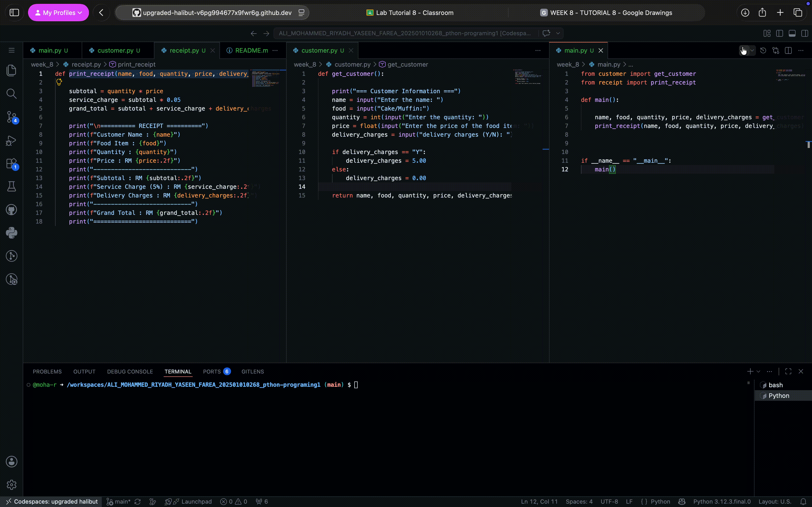

# Food Delivery Receipt Generator

## Purpose of the Application

This Python application collects customer and order information, calculates the required charges, and prints a food delivery receipt.

## Tech Stack

- Python 3
- Command-line interface (CLI)
- Python modules

## How to Use

1. Keep `main.py`, `customer.py`, and `receipt.py` in the same folder.
2. Open a terminal in the project folder.
3. Run the application:

   ```bash
   python main.py
   ```

4. Enter the requested customer and order information.
5. The application will display the completed receipt.

## Application Demonstration
