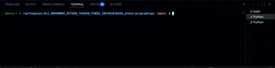

# IT Helpdesk Ticket Registration System

## Purpose of the Application

The purpose of this application is to create a simple IT Helpdesk Ticket Registration System for City University Malaysia.

The system allows students to report technical issues such as login problems, WiFi connection problems, printer malfunctions, and password reset requests.

The student needs to enter their name, student ID, issue, location, and priority level.

Based on the priority level, the system will automatically assign a technician:

- High Priority: Ahmad
- Medium Priority: Siti
- Low Priority: Ali

After the information is entered, the system will display the complete helpdesk ticket with the status set to Pending.

## Tech Stack

- Python
- GitHub

## How to Use

1. Open the project folder.

2. Make sure the following files are available:
   - `main.py`
   - `ticket.py`
   - `display.py`

3. Open the terminal in the project directory.

4. Run the following command:

```bash
python main.py
```

5. Enter the required information:
   - Student Name
   - Student ID
   - Issue
   - Location
   - Priority Level (High/Medium/Low)

6. The system will automatically assign a technician based on the selected priority level.

7. The complete helpdesk ticket will be displayed on the screen.

## Demonstration

The following demonstration shows how the IT Helpdesk Ticket Registration System works.

